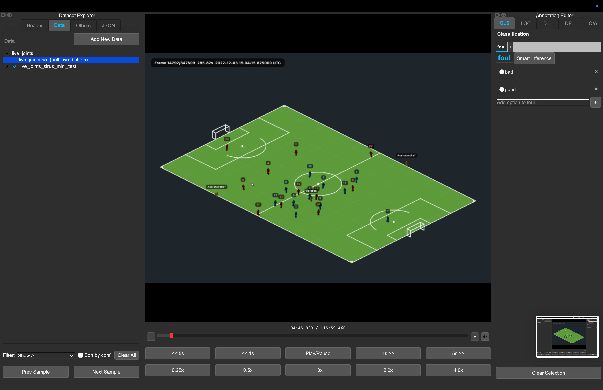
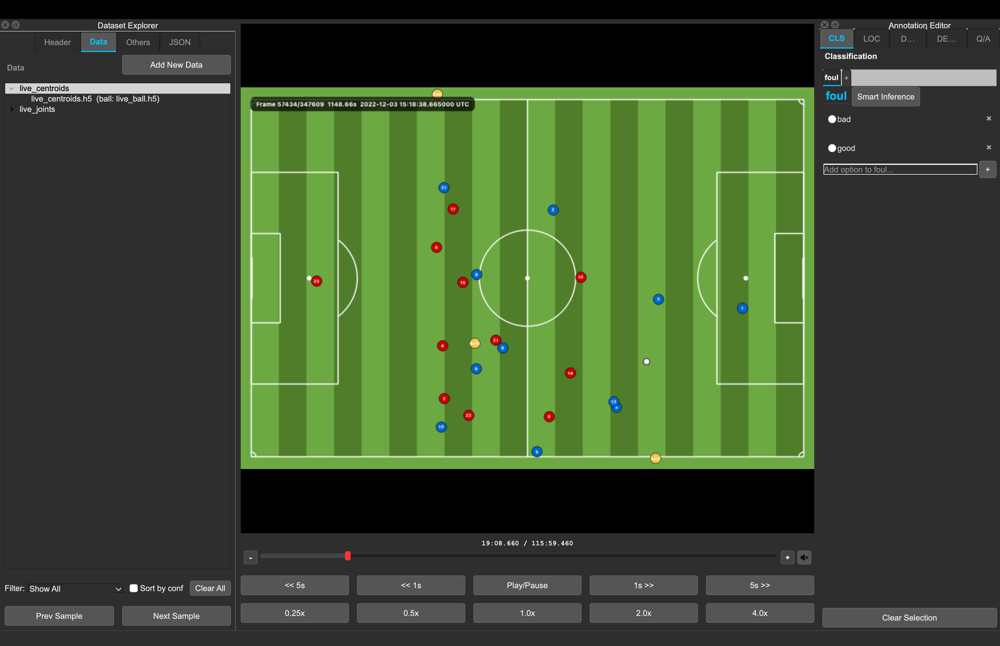

# OSL JSON Format

This page describes the OSL-style JSON files loaded, edited, and written by the
Video Annotation Tool.

An OSL JSON file is a single JSON object with dataset metadata, a label schema,
and a `data` array of samples. Each sample points to one or more media inputs and
can carry task-specific annotations.

## Minimal Valid File

This is the smallest practical shape for a dataset with one video sample:

```json
{
  "version": "2.0",
  "date": "2026-05-19",
  "dataset_name": "minimal-demo",
  "description": "",
  "modalities": ["video"],
  "metadata": {},
  "labels": {},
  "data": [
    {
      "id": "clip_0001",
      "inputs": [
        {
          "type": "video",
          "path": "clips/clip_0001.mp4"
        }
      ]
    }
  ]
}
```

!!! note "Relative paths"
    Relative `inputs[].path` values are resolved from the folder that contains
    the JSON file. If you move the JSON without moving its media folders,
    playback can fail.

## Common Mistakes

| Mistake | Result | Fix |
|---|---|---|
| Root JSON is an array | The app rejects the file. | Use one root object with a `data` array. |
| `data` is missing or not a list | The app rejects the file. | Set `data` to `[]` or a list of sample objects. |
| Using top-level `questions` for Q/A | Legacy question banks are dropped on save. | Store Q/A in each sample's grouped `answers[]`. |
| Dense captions use `start_ms`/`end_ms` only | The current dense editor expects point timestamps. | Use `dense_captions[].position_ms` and, when UTC is known, `timestamp_utc`. |
| Annotation head names do not match root `labels` | Controls may not show the expected labels. | Keep `data[].labels` keys and `events[].head` values aligned with root `labels`. |
| Relative media paths no longer point to files | Samples load but playback cannot find media. | Keep media beside the JSON or resave after correcting paths. |

## Top-Level Object

The smallest useful file is a JSON object with `data` as a list. When loading,
the app fills missing standard fields with defaults. When saving, it writes the
standard project fields back out.

| Field | Type | Notes |
|---|---|---|
| `version` | string | Current app default is `"2.0"`. |
| `date` | string | Usually an ISO date such as `"2026-05-19"`. |
| `dataset_name` | string | Human-readable project name. |
| `description` | string | Free-text dataset description. Empty string is allowed. |
| `modalities` | array | Input types present in the dataset, for example `["video"]`. The app recomputes this from sample inputs on save. |
| `metadata` | object | Dataset-level custom metadata. |
| `labels` | object | Label schema shared by classification and localization heads. |
| `data` | array | Sample list. This must be a list. |

Unknown root keys are preserved, except retired legacy keys documented below.

## Label Schema

The root `labels` object defines annotation heads. Each head name is a key, and
each definition should include:

- `type`: `single_label` or `multi_label`.
- `labels`: list of allowed label strings.

```json
{
  "labels": {
    "action": {
      "type": "single_label",
      "labels": ["pass", "shot", "foul"]
    },
    "attributes": {
      "type": "multi_label",
      "labels": ["left_foot", "header", "set_piece"]
    }
  }
}
```

Classification and localization annotations should reference these same head
names. For example, `data[].labels.action` and `data[].events[].head == "action"`
both point at the root `labels.action` schema.

## Sample Objects

Each entry in `data` is one sample.

| Field | Type | Notes |
|---|---|---|
| `id` | string | Stable sample ID. Missing or duplicate IDs are normalized on load/save. Duplicates receive suffixes such as `__2`. |
| `inputs` | array | Media or feature files for this sample. Multi-view samples use multiple input entries. |
| `metadata` | object | Optional sample-level metadata. Empty metadata is removed on save. |
| `labels` | object | Classification payload for this sample. |
| `events` | array | Timestamped localization events. |
| `captions` | array | Clip-level description captions. |
| `dense_captions` | array | Timestamped dense descriptions. |
| `answers` | array | Grouped question/answer annotations. |

Unknown sample keys are preserved.

## Input Objects

Each sample should include `inputs`, even if the sample has only one media file.

```json
{
  "inputs": [
    {
      "type": "video",
      "path": "clips/clip_0001.mp4",
      "fps": 25.0,
      "UTC_time_start": "2022-12-03 13:27:59.461000"
    }
  ]
}
```

Supported input types:

| Type | Typical path | Notes |
|---|---|---|
| `video` | `clips/clip_0001.mp4` | Default when type is missing and the extension is not special. |
| `frames_npy` | `frames/clip_0001.npy` | Uses `fps` for playback timing. The legacy alias `frame_npy` is normalized to `frames_npy`. |
| `tracking_parquet` | `tracking/clip_0001.parquet` | Uses parquet timestamps when available. Optional `fps` is a fallback. |
| `player_joints_h5` | `tracking/live_joints.h5` | Uses absolute UTC values from `timestamp_utc` for playback timing and renders a 3D stickman preview. Optional `ball_path` overlays ball XYZ from a separate H5 file. |
| `player_centroids_h5` | `tracking/live_centroids.h5` | Uses absolute UTC values from `timestamp_utc` for playback timing and renders top-down player centroids. Optional `ball_path` overlays ball XYZ from a separate H5 file. |

`UTC_time_start` is optional for every input type and denotes the absolute UTC
instant at local playback position `00:00.000`. It accepts ISO-compatible
timestamps with a space or `T` separator, optional fractional seconds, `Z`, or
an explicit timezone offset. Naive values are treated as UTC. A valid explicit
value overrides backend-derived timing, including H5 `timestamp_utc`. An empty
or malformed explicit value makes the input relative instead of falling back to
backend timing. The original field is preserved in project JSON unless it is
changed through synchronization or the viewer's Set/Correct/Remove UTC actions.

Point annotations in `events[]` and `dense_captions[]` may contain both
`timestamp_utc` and `position_ms`. A valid `timestamp_utc` is the authoritative
real-world instant; `position_ms` is a backward-compatible projection relative
to the currently resolved sample timeline origin:

```text
timestamp_utc = timeline_origin_utc + position_ms
position_ms = timestamp_utc - timeline_origin_utc
```

Canonical annotation UTC is serialized as `YYYY-MM-DD HH:MM:SS.ffffff`. Input
may use ISO-compatible timestamps with `T`, `Z`, or timezone offsets; aware
values are normalized to UTC and naive values are interpreted as UTC. Samples
may freely mix absolute and legacy relative annotations.

New and edited annotations write both fields when a genuine UTC origin is
available. Save/export promotes legacy relative annotations and recomputes
compatibility positions where such an origin can be resolved. No synthetic UTC
origin is generated for relative-only samples. A malformed `timestamp_utc` is
preserved and falls back to `position_ms`; it is replaced with normalized UTC
only when the annotation is explicitly edited. Conflicting dual fields resolve
in favor of valid `timestamp_utc`. Absolute annotations are preserved even when
their projected positions are negative or beyond the available media duration.

In Localization and Dense Description tables, a resolvable annotation is shown
as `YYYY-MM-DD HH:MM:SS.mmm UTC`; otherwise it is shown as relative
`MM:SS.mmm`. Editing a UTC Time cell accepts the same ISO-compatible forms,
normalizes `timestamp_utc`, and derives `position_ms`. Table selection, timeline
markers, navigation, and media seeking always use the projected `position_ms`.

Input paths, including optional `ball_path` overlays, can be relative or absolute
when loading. On save, paths are rewritten relative to the saved JSON file
location when possible.

Optional ball overlay for player H5 inputs:

```json
{
  "type": "player_centroids_h5",
  "path": "tracking/live_centroids.h5",
  "ball_path": "tracking/live_ball.h5"
}
```

Player-joint H5 inputs use UTC timing from `timestamp_utc`, support the same
media controls as video inputs, and render 3D stickmen:

```json
{
  "type": "player_joints_h5",
  "path": "tracking/live_joints.h5",
  "ball_path": "tracking/live_ball.h5"
}
```



Player-centroid H5 inputs use UTC timing from `timestamp_utc`, support the same
media controls, and render a top-down field view:

```json
{
  "type": "player_centroids_h5",
  "path": "tracking/live_centroids.h5",
  "ball_path": "tracking/live_ball.h5"
}
```



Multi-view samples use more than one input:

```json
{
  "id": "play_0001",
  "inputs": [
    {"type": "video", "path": "wide/play_0001.mp4", "fps": 25.0},
    {"type": "video", "path": "close/play_0001.mp4", "fps": 25.0}
  ]
}
```

## Task Payloads

### Classification

Sample-level `labels` uses the same head names defined at the root.

```json
{
  "labels": {
    "action": {
      "label": "shot"
    },
    "attributes": {
      "labels": ["left_foot", "set_piece"]
    }
  }
}
```

Legacy project files may contain smart predictions whose head payload includes `confidence_score` as a float
from `0.0` to `1.0`:

```json
{
  "labels": {
    "action": {
      "label": "shot",
      "confidence_score": 0.91
    }
  }
}
```

The loader remains compatible with this shape. New inference predictions are
kept transient; accepting writes only the chosen label as a manual annotation.

### Localization

Localization annotations live in `events`. Each event is a point annotation.
The first row below uses the preferred dual-field representation; the second is
a valid legacy relative row.

```json
{
  "events": [
    {
      "head": "action",
      "label": "pass",
      "position_ms": 1240,
      "timestamp_utc": "2026-01-01 12:00:01.240000"
    },
    {
      "head": "action",
      "label": "shot",
      "position_ms": 4320,
      "confidence_score": 0.84
    }
  ]
}
```

`head` should match a root label head. Smart localization predictions use the
same optional `confidence_score` convention as classification.

### Description

Description annotations live in `captions`. The app writes one English caption
for manual description edits, but additional caption fields are preserved.

```json
{
  "captions": [
    {
      "lang": "en",
      "text": "A player receives the pass and shoots from the edge of the box."
    }
  ]
}
```

### Dense Description

Dense description annotations live in `dense_captions`. The current dense editor
uses point timestamps. The example intentionally mixes one preferred absolute
row with one supported legacy relative row.

```json
{
  "dense_captions": [
    {
      "position_ms": 1200,
      "timestamp_utc": "2026-01-01 12:00:01.200000",
      "lang": "en",
      "text": "The midfielder receives the ball."
    },
    {
      "position_ms": 4300,
      "lang": "en",
      "text": "The forward takes a shot."
    }
  ]
}
```

### Question/Answer

Q/A annotations live in grouped per-sample `answers`. Each group stores the
question text and one or more non-empty answers.

```json
{
  "answers": [
    {
      "question": "What happens after the pass?",
      "answers": ["The receiving player shoots."]
    }
  ]
}
```

Legacy top-level `questions` and per-answer `question_id` entries are not
persisted. Convert old VQA files with `tools/convert_legacy_vqa_to_grouped.py`.

While a generated answer is awaiting review, an `answers[]` entry may also be
an object:

```json
{
  "text": "The receiving player shoots.",
  "confidence_score": 0.82,
  "inference_model_id": "sports-vqa-v2"
}
```

The loader preserves manual strings and legacy smart answer objects. New Q/A,
caption, and dense-caption predictions remain transient until accepted. Legacy
smart captions and dense captions use the same optional `confidence_score` and
`inference_model_id` fields on their existing objects.

## Complete Examples

### Classification JSON

```json
{
  "version": "2.0",
  "date": "2026-05-19",
  "dataset_name": "soccer-classification-demo",
  "description": "Clip-level action labels.",
  "modalities": ["video"],
  "metadata": {
    "sport": "soccer",
    "split": "train"
  },
  "labels": {
    "action": {
      "type": "single_label",
      "labels": ["pass", "shot", "foul"]
    },
    "attributes": {
      "type": "multi_label",
      "labels": ["left_foot", "header", "set_piece"]
    }
  },
  "data": [
    {
      "id": "clip_0001",
      "inputs": [
        {
          "type": "video",
          "path": "clips/clip_0001.mp4",
          "fps": 25.0
        }
      ],
      "labels": {
        "action": {
          "label": "shot"
        },
        "attributes": {
          "labels": ["left_foot"]
        }
      },
      "metadata": {
        "match_id": "match_01"
      }
    }
  ]
}
```

### Localization and Dense Description JSON

```json
{
  "version": "2.0",
  "date": "2026-05-19",
  "dataset_name": "soccer-timeline-demo",
  "description": "Timestamped events and dense captions.",
  "modalities": ["video"],
  "metadata": {},
  "labels": {
    "action": {
      "type": "single_label",
      "labels": ["pass", "shot", "save"]
    }
  },
  "data": [
    {
      "id": "attack_0001",
      "inputs": [
        {
          "type": "video",
          "path": "clips/attack_0001.mp4",
          "fps": 25.0,
          "UTC_time_start": "2026-01-01 12:00:00.000000"
        }
      ],
      "events": [
        {
          "head": "action",
          "label": "pass",
          "position_ms": 1100,
          "timestamp_utc": "2026-01-01 12:00:01.100000"
        },
        {
          "head": "action",
          "label": "shot",
          "position_ms": 3650,
          "timestamp_utc": "2026-01-01 12:00:03.650000"
        }
      ],
      "captions": [
        {
          "lang": "en",
          "text": "A quick attack ends with a shot on goal."
        }
      ],
      "dense_captions": [
        {
          "position_ms": 1100,
          "timestamp_utc": "2026-01-01 12:00:01.100000",
          "lang": "en",
          "text": "The midfielder plays a forward pass."
        },
        {
          "position_ms": 3650,
          "timestamp_utc": "2026-01-01 12:00:03.650000",
          "lang": "en",
          "text": "The striker shoots from inside the area."
        }
      ]
    }
  ]
}
```

### Multi-Input Q/A JSON

```json
{
  "version": "2.0",
  "date": "2026-05-19",
  "dataset_name": "multi-view-qa-demo",
  "description": "Two synchronized views with question/answer labels.",
  "modalities": ["video"],
  "metadata": {
    "sport": "basketball"
  },
  "labels": {},
  "data": [
    {
      "id": "possession_0001",
      "inputs": [
        {
          "type": "video",
          "path": "broadcast/possession_0001.mp4",
          "fps": 30.0
        },
        {
          "type": "video",
          "path": "baseline/possession_0001.mp4",
          "fps": 30.0
        }
      ],
      "answers": [
        {
          "question": "Which team ends the possession?",
          "answers": ["The home team."]
        },
        {
          "question": "How does the possession end?",
          "answers": ["A made three-point shot."]
        }
      ]
    }
  ]
}
```

## Save-Time Behavior

On save/export, the app:

- Ensures unique sample IDs.
- Normalizes input types, including `frame_npy` to `frames_npy`.
- Rewrites input paths relative to the output JSON location when possible.
- Recomputes `modalities` from `data[].inputs[]`.
- Removes empty optional sample fields such as `labels`, `events`, `captions`,
  `dense_captions`, `answers`, and `metadata`.
- Normalizes Q/A answers to grouped `{"question": ..., "answers": [...]}` entries
  with non-empty text.
- Drops legacy top-level `questions` and `question_id` answer entries.
- Drops retired sample smart keys such as `smart_labels` and `smart_events`.
- Does not persist localization `label_colors`; label colors live in app
  settings.
- Preserves unknown root and sample fields where possible.
