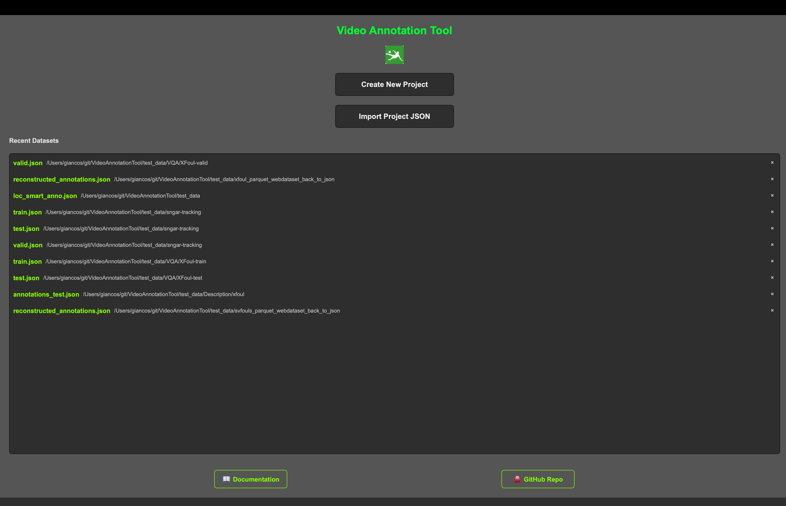
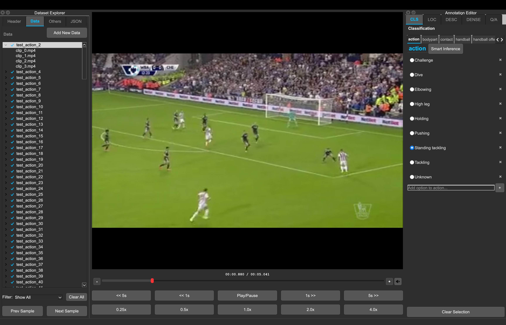
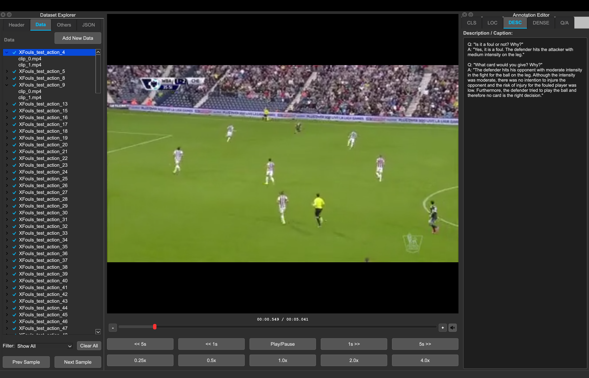
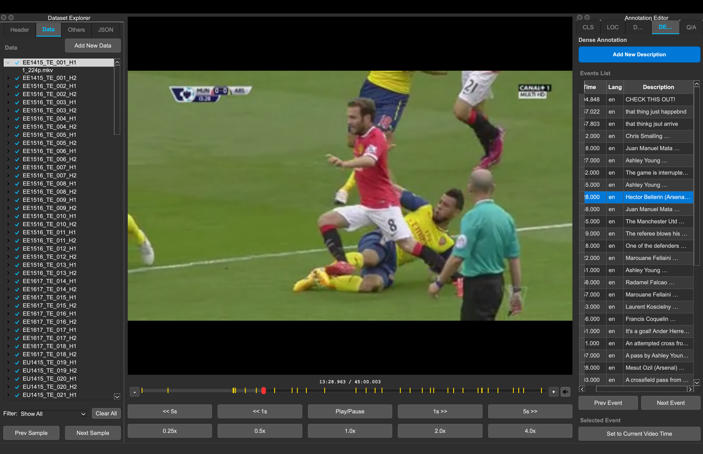

# GUI Overview

The OSL Annotation Tool supports four distinct annotation modes: **Classification**, **Localization (Action Spotting)**,**Description** and **Dense Description**.. The interface adapts based on the project type selected at startup.

### Quick Demo for the whole tool
<iframe src="https://drive.google.com/file/d/1EgQXGMQya06vNMuX_7-OlAUjF_Je-ye_/preview" width="1280" height="600" allow="autoplay" allowfullscreen></iframe>


---
# 1. Welcome Page (Startup Interface)

The Welcome Page is the entry point of the OSL Annotation Tool. It allows users to create or import projects and access additional resources.



### Main Actions

* **Create New Project**

  * Start a new annotation project.
  * You will be prompted to select the annotation mode (Classification, Localization, Description, or Dense Description).
  * Initializes an empty workspace.

* **Import Project JSON**

  * Load an existing annotation project from a JSON file.
  * The interface automatically adapts to the project type.
  * If the JSON contains validation errors, a detailed error message will be displayed.

### Additional Resources

* **Video Tutorial**

  * Opens a guided tutorial explaining how to use the tool.
  * Recommended for first-time users.

* **GitHub Repo**

  * Redirects to the official GitHub repository.
  * Includes documentation, updates, and issue tracking.

---

## 2. Classification Mode

Designed for assigning global labels (Single or Multi-label) to video clips.



### Left Panel: Clip Management
- **Scene/Clip List:** Displays the list of imported video files.
  - **Status Icons:** A checkmark (✓) indicates the clip has been annotated.
- **Add Data:** Import new video files into the current project.
- **Clear:** Clears the current workspace.
- **Project Controls:** New Project, Load Project, Add Data, Save JSON, Export JSON.


### Center Panel: Video Player
- **Video Display:** Main playback area for the selected clip.
- **Playback Controls:**
  - Standard Play/Pause.
  - Frame stepping and seeking (1s, 5s).
  - Playback speed control (0.25x to 4.0x).

### Right Panel: Command Center
The right sidebar has been upgraded into a tabbed interface to separate manual work from AI features.

* **Global Tools:** Hosts the Undo/Redo history controls, current Task name, and a "Category Editor" to dynamically add new labeling heads.

* **Tab 1: Hand Annotation**
  * **Dynamic Label Groups:** Automatically renders Radio buttons for mutually exclusive categories (Single Label) or Checkboxes for non-exclusive attributes (Multi Label) based on the JSON schema.
  * **On-the-fly Editing:** Users can add or delete individual label options directly within each group using the `+` and `×` buttons.

* **Tab 2: Smart Annotation**
  * **AI Inference:** Users can run predictions on the current video ("Single Inference") or across a selected range of videos ("Batch Inference").
  * **Visual Confidence:** Displays an interactive, custom-built Donut Chart that visualizes the AI's predicted label and its confidence probability percentages.
  * **Batch Review:** Provides a text console summarizing the predicted classes for multiple videos before they are confirmed.

* **Tab 3: Train**
  * **Hyperparameter Configuration:** Allows users to set Epochs, Learning Rate (LR), Batch Size, Device (CPU, CUDA, MPS), and Workers.
  * **Live Monitoring:** Features "Start/Stop" controls, a live progress bar, and a real-time console that intercepts PyTorch logs directly within the application.

* **Bottom Actions (Tab-Aware):**
  * **Confirm Annotation:** Saves the selection to the clip. Its behavior adapts based on the active tab (saving hand inputs vs. merging AI predictions).
  * **Clear Selection:** Resets the active inputs or clears pending smart predictions.
  * 
### 🎥 Feature Demonstrations 

<div style="display: flex; flex-wrap: wrap; justify-content: space-between; gap: 10px;">

  <div style="flex: 1; min-width: 300px;">
    <h4 align="center">1.  (Hand Annotation)</h4>
    <iframe src="https://drive.google.com/file/d/15u9y5uPMyrOZ3RBSiwfTJjwxrhsSzeS-/preview" width="100%" height="250" allow="autoplay" allowfullscreen style="border:none; border-radius: 8px;"></iframe>
  </div>

  <div style="flex: 1; min-width: 300px;">
    <h4 align="center">2. (Smart Annotation)</h4>
    <iframe src="https://drive.google.com/file/d/1hSu0QChEFz4xlKnKBUSpD7wEBXp17oq3/preview" width="100%" height="250" allow="autoplay" allowfullscreen style="border:none; border-radius: 8px;"></iframe>
  </div>

  <div style="flex: 1; min-width: 300px;">
    <h4 align="center">3.  (Model Training)</h4>
    <iframe src="https://drive.google.com/file/d/1oqqyua8KEkc5ijxyf5NywpZtk7NbM-9C/preview" width="100%" height="250" allow="autoplay" allowfullscreen style="border:none; border-radius: 8px;"></iframe>
  </div>

</div>
---

## 3. Localization Mode (Action Spotting)

Designed for marking specific timestamps (spotting) with event labels.


### Left Panel: Sequence Management
- **Clip List:** Hierarchical view of video sequences.
- **Project Controls:** New Project, Load Project, Add Data, Save JSON, Export JSON.
- **Filter:** Filter the list to show "All", "Labelled Only", or "Unlabelled Only".
- **Clear All:** Resets the entire workspace.

### Center Panel: Timeline & Player
- **Media Preview:** Video player with precise seeking.
- **Timeline:** Visual representation of the video duration.
  - **Markers:** Blue ticks indicate spotted events on the timeline.
- **Playback Controls:** Includes standard transport controls and variable speed playback.

### Right Panel: Command Center
This panel is now divided into two distinct tabs to separate manual workflow from AI assistance.

#### **Tab 1: Hand Annotation**
* **Top: Spotting Controls (Tabs)**
  * **Multi-Head Tabs:** Organize labels by categories (Heads) such as "Action", "Card", "Goal".
  * **Label Grid:** Click any label button to instantly **spot an event** at the current playhead time. Uses an optimized bin-packing layout.
  * **Context Menu:** Right-click a label to **Rename** or **Delete** it.
  * **Add New Label:** Add a new label to the current category and automatically stamp it to the current time.
* **Bottom: Event List (Table)**
  * **In-place Editing:** Double-click a cell to directly modify the timestamp or label text.
  * **Time Sync Tool:** Select an existing event and click **"Set to Current Video Time"** to instantly snap the event's timestamp to the player's active frame.

#### **Tab 2: Smart Annotation**
* **Inference Range:** Use custom time inputs (or the "Set to Current" buttons) to define precise start and end boundaries for AI action spotting.
* **Dual Tables:** * **Predicted Events:** Review AI-generated events (with confidence scores) before they are merged into your dataset.
  * **Confirmed Events:** Displays events that have been successfully verified and saved.
* **Confirmation Workflow:** Users can visually verify gold markers on the timeline, click a row to jump to that timestamp, and finally click "Confirm Predictions" to officially merge them.

### 🎥 Feature Demonstrations 

<div style="display: flex; flex-wrap: wrap; justify-content: space-between; gap: 10px;">

  <div style="flex: 1; min-width: 300px;">
    <h4 align="center">1.  (Hand Spotting)</h4>
    <iframe src="https://drive.google.com/file/d/1nUW8-mnjaz267djeAoOlA1lhFwsmhQTL/preview" width="100%" height="280" allow="autoplay" allowfullscreen style="border:none; border-radius: 8px;"></iframe>
  </div>

  <div style="flex: 1; min-width: 300px;">
    <h4 align="center">2.  (Smart Spotting)</h4>
    <iframe src="https://drive.google.com/file/d/1mWSe_2VgAWhtQR-mzetPaWnYbCA0wHW7/preview" width="100%" height="280" allow="autoplay" allowfullscreen style="border:none; border-radius: 8px;"></iframe>
  </div>

</div>
---

# 4. Description Mode (Clip-level Description / Captioning)

Designed for assigning structured textual descriptions to short video clips, including question–answer style annotations.



### Left Panel: Action / Clip Management

* **Action List:** Displays imported action clips (e.g., XFouls_test_action_*).

  * A checkmark (✓) indicates the clip has been annotated.
* **Project Controls:** New Project, Load Project, Add Data, Save JSON, Export JSON.
* **Filter:** Filter by annotation status.
* **Clear All:** Clears the current workspace.

---

### Center Panel: Video Player

* **Video Display:** Main playback area for the selected action clip.
* **Timeline Slider:** Shows clip progress.
* **Playback Controls:**

  * Play / Pause
  * Navigate between actions or clips
  * Fine seeking
* **Time Indicator:** Displays current time and total clip duration.

---

### Right Panel: Description / Caption Annotation

This panel is dedicated to structured textual annotation.

#### Description / Caption Text Area

* Large editable text field.
* Supports multi-line structured annotations.
* Typical format includes:

  * Question–Answer (Q/A)
  * Event reasoning explanations
  * Referee decision analysis

Example structure:

```
Q: "Is it a foul or not? Why?"
A: "..."
```

#### Controls

* **Confirm**

  * Saves the description to the current clip.
* **Clear**

  * Clears the text field without saving.
* **Undo / Redo**

  * Reverts recent text changes.
 

### Quick Demo for Description Mode
<iframe src="https://drive.google.com/file/d/1tiqEyY9DTJo12u41y_1TFHeXtWLIfI86/preview" width="1280" height="600" allow="autoplay" allowfullscreen></iframe>
---

# 5. Dense Description Mode (Event-level Captioning)

Designed for fine-grained event-level captioning across full-length videos.



This mode combines timestamped events with free-text descriptions.

---

## Left Panel: Video Management

* **Video List:** Displays imported video halves (e.g., GB1415_TE_001_H1, H2).

  * ✓ indicates that the video contains at least one annotated event.
* **Project Controls:** New Project, Load Project, Add Data, Save JSON, Export JSON.
* **Filter:** Filter videos by annotation state.
* **Clear All:** Resets workspace.

---

## Center Panel: Timeline & Player

* **Media Preview:** Main video playback window.
* **Timeline:**

  * Visual representation of the full video duration.
  * **Markers:**

    * Yellow ticks represent annotated events.
    * Red indicator represents the current playhead position.
* **Current Time Display:** Shown above the description input.
* **Playback Controls:**

  * Frame stepping
  * 1s / 5s seeking
  * Speed control (0.25x–4.0x)
  * Previous/Next event navigation

---

## Right Panel: Dense Annotation

Divided into two functional areas.

---

### Top: Create / Edit Description

* **Current Time Indicator**

  * Displays the precise timestamp of the playhead.
* **Description Text Box**

  * Enter detailed natural-language descriptions of events.
  * Designed for dense commentary-style annotation.
* **Confirm Description**

  * Saves a new event at the current timestamp.
  * Adds a marker to the timeline.
  * Appends the event to the event table.

---

### Bottom: Events List (Table)

Displays all annotated events in chronological order.

#### Columns:

* **Time** – Timestamp of the event.
* **Lang** – Language tag (e.g., "en").
* **Description** – The textual annotation.

#### Interaction:

* **Single-click** – Select event.
* **Double-click** – Jump to event timestamp.
* **Editing** – Modify description text and confirm to update.
* **Delete** – Remove event from table and timeline.

### Quick Demo for Dense Description Mode
<iframe src="https://drive.google.com/file/d/1MLAVYg1_uVhIUR4AjRjLwiEIuL8GE3xc/preview" width="1280" height="600" allow="autoplay" allowfullscreen></iframe>
---
