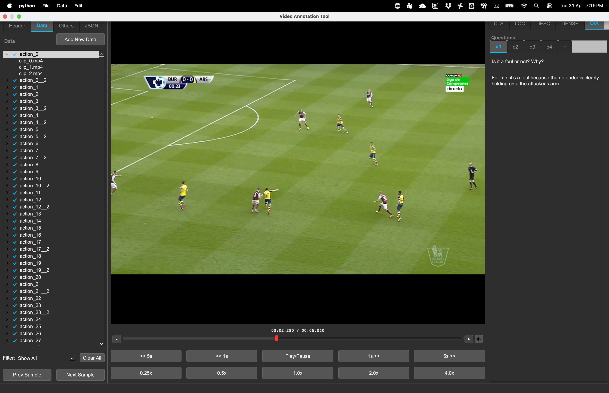

# GUI Overview

The workspace has three regions: Dataset Explorer (left), Media Center (middle), and Annotation Editor tabs (right).

## Welcome Screen

- **Create New Dataset**
- **Load Dataset**
- Recent datasets list
- Links to docs/tutorial and GitHub

## Workspace Layout

### Left: Dataset Explorer

- Tree of samples (parent row) and inputs (child rows)
- Filter: `Show All`, `Show Labelled`, `Show Smart Labelled`, `Show Not Labelled`
- `Add Data`, `Prev`, `Next`, `Clear All`
- Context menu on tree rows for removing a sample or a single input
- Header inspector tabs:
  - Known header fields (editable)
  - Unknown/custom root keys (read-only)
  - Raw JSON preview

### Middle: Media Center

- Video preview
- Timeline + zoom
- Marker overlays (mode-dependent)
- Playback controls (seek/playback rate)
- Mute icon button (state persists via app settings)

### Right: Annotation Tabs

#### Classification (`CLS`)

- Edit label heads and labels
- Supports single-label and multi-label heads
- Manual edits are saved immediately on effective change
- Smart inference per head with confirm/reject

#### Localization (`LOC`)

- Spot events at current playhead time
- Head/label add/rename/delete + per-label colors
- Event table supports edit, delete, confirm/reject smart events
- Smart inference with model + time-range prompts

#### Description (`DESC`)

- Clip-level text editor for captions
- Autosaves after short idle delay when text changes

#### Dense Description (`DENSE`)

- `Add New Description` opens a modal and inserts at current playhead time
- Dense events are editable/deletable in the table
- Events are kept chronological by `position_ms`

#### Question/Answer (`Q/A`)

- Dataset-level question tabs (`q1`, `q2`, ...)
- `+` tab adds a question
- Right-click question tab to rename/delete
- Per-sample answer editor autosaves after short idle delay
