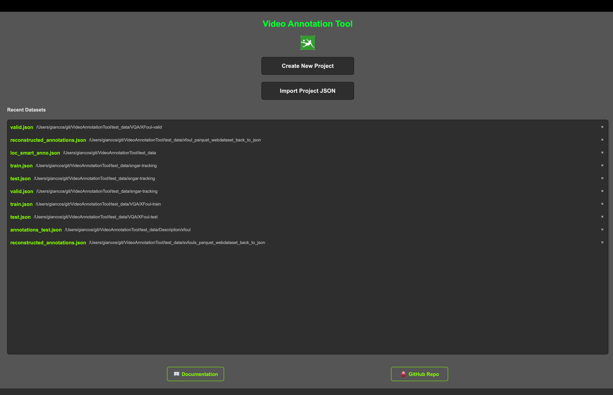
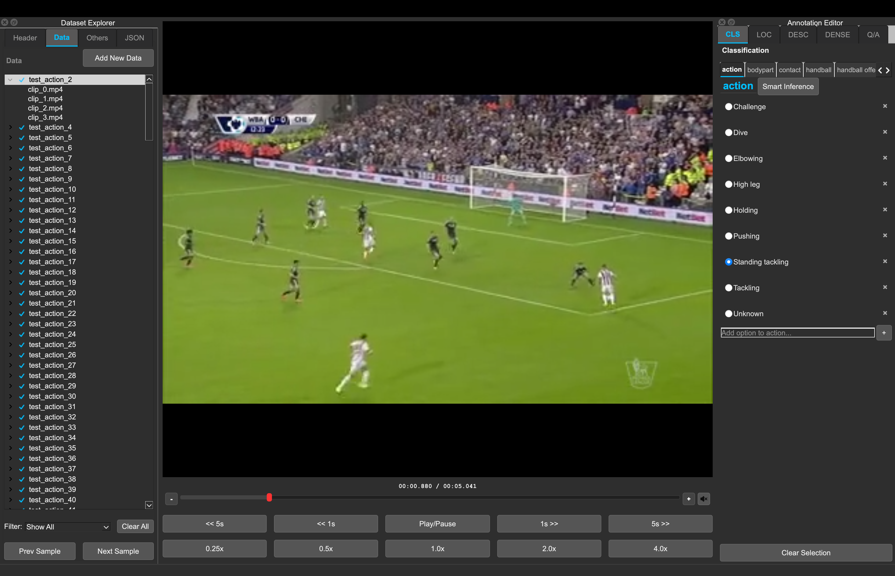
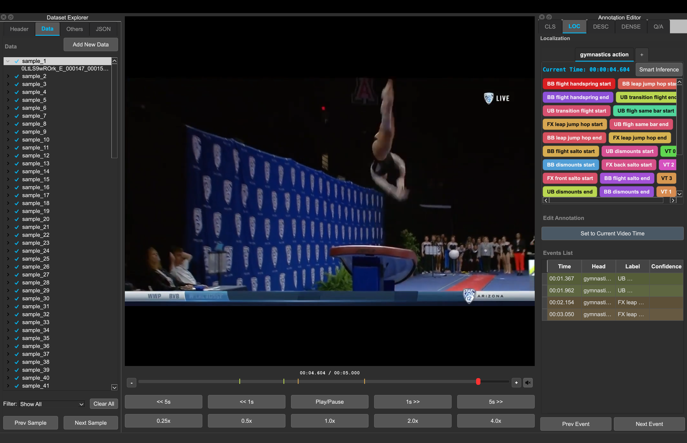
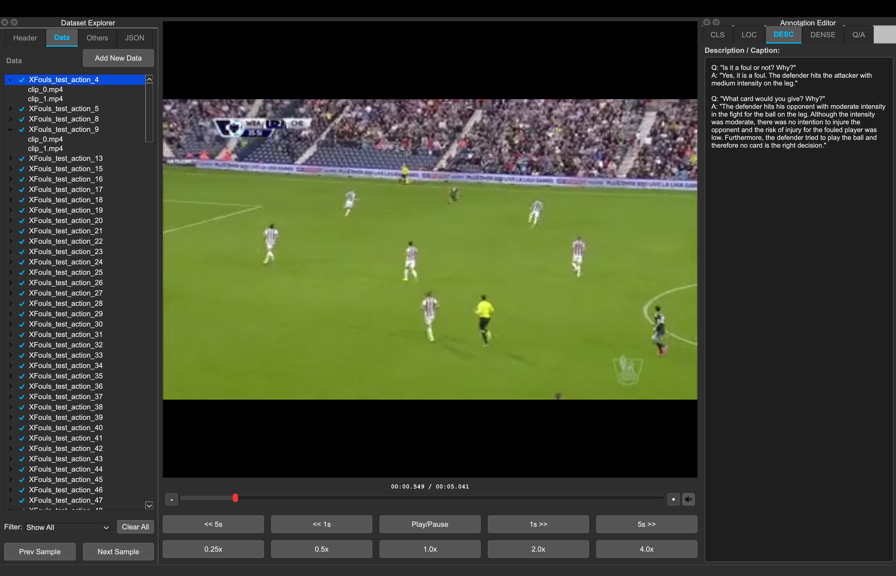
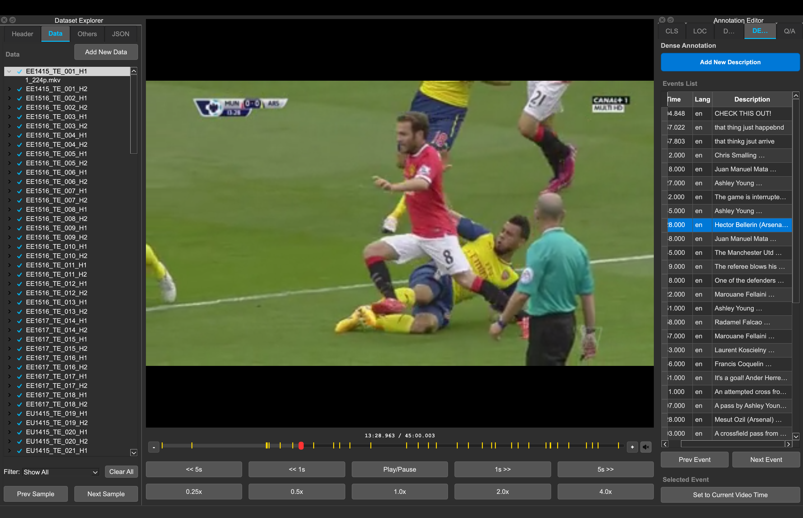
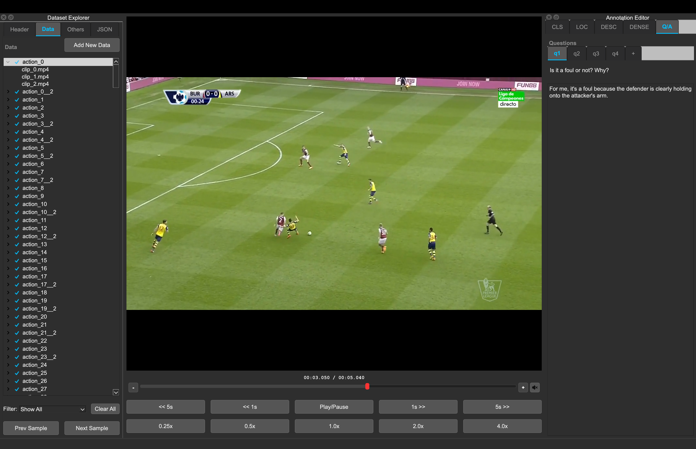

# GUI Overview

The workspace has three regions: Dataset Explorer (left), Media Center (middle), and Annotation Editor tabs (right).

## Welcome Screen

- **Create New Dataset**
- **Load Dataset**
- Recent datasets list
- Links to docs/tutorial and GitHub

## Workspace Layout

The **View** menu controls the workspace layout. **Dataset Explorer** and
**Annotation Editor** can be shown or hidden independently. Under **Viewer
Layout**, choose **Single Modality**, **Mosaic**, or **Modality Tabs**. These
choices are application preferences and are restored when the app restarts;
they are not written to dataset JSON.

The **Edit → Settings…** dialog contains application-wide preferences. On its
**Media Controls** page, comma-separated playback factors and seek intervals
change the two media-control rows immediately when **Apply** or **OK** is used.

The **Inference** settings tab selects Local or Remote execution, configures the
server URL, tests `/api/v1/capabilities`, maps local directories to advertised
server storage roots, and manages local model config/weights entries. See
[Local and Remote Inference](inference.md).

On **Dataset Explorer**, **Samples per page** controls the bounded tree window
(500 by default, configurable from 100 to 2,000) and applies immediately.
These preferences are stored in application settings and are never added to a
dataset JSON file.

### Left: Dataset Explorer

- Tree of samples (parent row) and inputs (child rows)
- Filter: `Show All`, `Show Labelled`, `Show Smart Labelled`, `Show Not Labelled`
- `Add Data`, `Prev`, `Next`, `Clear All`
- Context menu on tree rows for removing a sample or a single input
- Header inspector tabs:
  - Known header fields (editable)
  - Unknown/custom root keys (read-only)
  - Raw JSON preview

Large datasets show one correctly sorted bounded window (500 samples by default).
Use the page number field or its `‹` and `›` buttons directly beneath the sample
list to jump directly or move one page. You can also scroll down again at the bottom
to open the next window, or scroll up at the top to return to the previous one.
The range below the tree shows the current sample positions.
Paging does not stop an active off-page sample; selecting another visible sample
replaces it normally. Filters apply to the complete dataset, not only the current
page. The raw JSON text is generated only when its inspector tab is opened.

Selecting a sample row preserves playback state: playing streams continue and
paused or stopped streams do not start. A sample row has no focused modality,
so all viewer contours are cleared. Selecting one of the active sample's input
rows only highlights its viewer and likewise leaves playback unchanged.

### Middle: Media Center

- **Single Modality** shows one input at a time; selecting an input row in the
  explorer switches the visible modality
- **Mosaic** shows all inputs in the existing adaptive two-column grid
- **Modality Tabs** keeps one tab per input so the visible modality can be
  selected from the media center
- Timeline + zoom
- Marker overlays (mode-dependent)
- Playback controls (seek/playback rate)
- Mute icon button (state persists via app settings)
- Per-viewer right-click actions for **Go to start**, **Go to end**, manual UTC
  start management, and visual UTC synchronization

Playback factors add both a direct and reciprocal speed, with `1x` always
present. For example, `2,4,8` creates `0.125x`, `0.25x`, `0.5x`, `1x`, `2x`,
`4x`, and `8x`. Seek intervals such as `1,5,10,30,60` create matching backward
and forward buttons around the Play/Pause button. Values must be positive,
finite comma-separated numbers; duplicates are normalized and displayed with
at most three decimal places. **Restore Defaults** restores `2,4` and `1,5` in
the dialog and takes effect after **Apply** or **OK**.

See [Synchronized Multi-Modality Playback](synchronized_playback.md) for UTC
alignment rules and the synchronization workflow.

Changing the viewer layout only changes presentation. Hidden modalities remain
loaded and synchronized, so switching layouts or tabs does not restart playback
or move the shared timeline. During manual UTC synchronization, single and tab
layouts stay pinned to the modality being synchronized.

### Right: Annotation Tabs

All five editors end with the same prediction-review footer. Accept/Reject and
bulk review actions appear only when pending predictions exist. Task-specific
prediction rows remain inline in the editor above it.

The **Inference Jobs** dock sits below the Annotation Editor. Its single
**Run Inference…** action opens a runtime-only dialog for the active annotation
mode, with task-compatible Local/Remote models, inputs, and applicable task
parameters. Server and model setup lives in **Edit → Settings → Inference**.
The dock shows active progress, FIFO waiting jobs, cancellation, recent outcomes,
and timestamped per-job details while leaving the status bar unobstructed.
It hides when the project closes and the welcome screen is restored; its View
action is disabled there, and its prior visibility returns with the workspace.
One Local and one Remote job may run
at the same time, and more runs can be queued without blocking the annotation
workspace. Predictions stay associated with the sample from which each request
was submitted even if another sample is selected before completion, and
completion does not switch the active annotation or head tab.

#### Classification (`CLS`)

- Edit label heads and labels
- Supports single-label and multi-label heads
- Manual edits are saved immediately on effective change
- Pending labels have inline Accept/Reject controls

#### Localization (`LOC`)

- Spot events at current playhead time
- Head/label add/rename/delete + per-label colors
- Event table supports edit, delete, confirm/reject smart events
- Time shows full UTC when resolvable and relative time otherwise; media seeking
  still uses the projected timeline position
- Pending events are visually distinct and can be reviewed inline

#### Description (`DESC`)

- Clip-level text editor for captions
- Autosaves after short idle delay when text changes

#### Dense Description (`DENSE`)

- `Add New Description` opens a modal and inserts at current playhead time
- Dense events are editable/deletable in the table
- Time shows full UTC when resolvable and accepts ISO-compatible UTC edits
- Events remain navigable by their projected `position_ms`

#### Question/Answer (`Q/A`)

- Per-sample question groups
- `Add` opens a question-entry dialog with previous dataset questions and custom text entry
- Double-click or right-click a question group to edit it; right-click can also remove it
- `Answer` opens a multiline answer dialog
- Double-click or right-click an answer to edit it; right-click can also remove it
- Multiple answers per question
- Edits autosave after short idle delay
