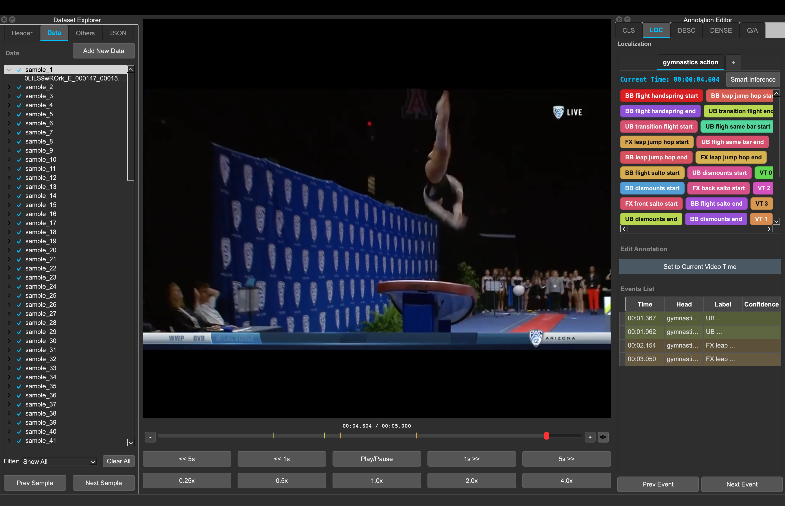

# Video Annotation Tool

The Video Annotation Tool is a PyQt6 desktop application for loading, editing, and exporting OSL-style sports-video datasets.

## What You Can Do

- Create, open, close, save, and export dataset JSON projects.
- Manage samples and multi-input clips from the Dataset Explorer.
- Annotate across five modes:
  - Classification (`labels`)
  - Localization (`events`)
  - Description (`captions`)
  - Dense Description (`dense_captions`)
  - Question/Answer (`questions` + `answers`)
- Use global undo/redo for tracked edits.
- Download from and upload to Hugging Face from the **Data** menu.

## Quick Links

- [Installation](installation.md)
- [Getting Started](getting_started.md)
- [GUI Overview](gui_overview.md)
- [Batch Tools](batch_tools.md)
- [OSL JSON Format](OSL.md)
- [FAQ](faq.md)

## License

This project is dual-licensed:

- **AGPL-3.0** (see `LICENSE`)
- **Commercial license** (see `LICENSE_COMMERCIAL`)
